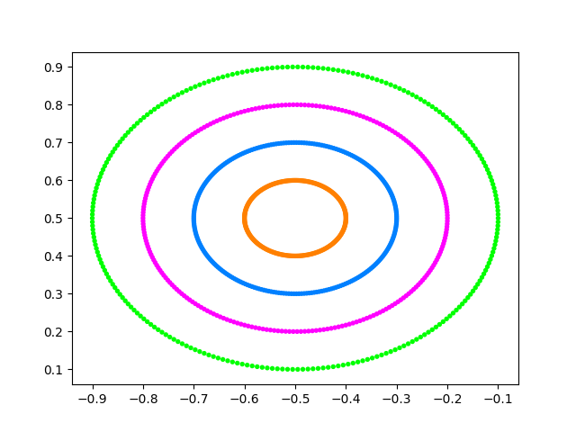

[](https://github.com/CascadingRadium/CUDA-Hungarian-Clustering/blob/main/LICENCE)
[](https://github.com/CascadingRadium/CUDA-Hungarian-Clustering/network)
[](https://github.com/CascadingRadium/CUDA-Hungarian-Clustering/stargazers)
[](https://github.com/CascadingRadium/CUDA-Hungarian-Clustering/issues)


# CUDA-Hungarian-Clustering
A GPU-Accelerated Clustering Algorithm that uses the Hungarian method

Written in CUDA and C++

Introduction:
  - Parameterless (Almost) Clustering Algorithm
  - Input is a single CSV file and the output will be a file named 'output.csv' which has the full original data + an extra 'label' column that specifies what cluster/group it belongs to.
  - Does not need any prior knowledge of the number of clusters/groups present in the dataset
  - Results similar to ones obtained from Spectral Clustering (but without the requirement of the number of clusters parameter)
  - Combined the work of two research papers:
      - A hierarchical clustering algorithm based on the Hungarian method, <i>Journal of Pattern Recognition Letters</i> (2008) (https://doi.org/10.1016/j.patrec.2008.04.003)
      - GPU-accelerated Hungarian algorithms for the Linear Assignment Problem, <i>Journal of Parallel Computing</i> (2016)  (https://doi.org/10.1016/j.parco.2016.05.012)
  - Mainly used to find the number of groups in the dataset with each group being a set of 'similar' rows similar to DBSCAN

Execution instructions:

```
nvcc Clustering.cu

./a.out [INPUT_FILE] [PARAMETER] [Number of Columns from right to skip/ignore] [Number of Rows from top to skip/ignore]

python3 plot_output.py 

```

INPUT FILE - Any file(.xlxs .csv) that can be opened in spreadsheet software like LibreOffice calc/MS Excel.

PARAMETER - Integral value in the range [0,8] for most inputs (must be manually tuned) - 7 works for most datasets (Independent of the real number of clusters in the dataset)

The other two command-line arguments are meant to filter out the label column and the column header row respectively before passing on the raw data to the model

Constraints:
- The input file should only have numeric columns (float/ integer)
- The input file should not have any NaN or null values - Dataset cleaning must be done prior
- Parameter tuning can only be possible if a rough estimate of the number of values the label can take is known, otherwise, a pure unsupervised clustering without any tuning can be done by just assuming Parameter as 7
- Sensitive to noise
- Parameter, being fully independent of the dataset, cannot be estimated and is mostly tuned based on trial-and-error, but almost always takes a value in the range [0,10] 

Working Example:

```
nvcc Clustering.cu
./a.out data_banknote_authentication.csv 10 1 1
```
This will now use parameter 10 and cluster the input .csv file into some number of groups and output a file named 'output.csv' which has an additional column called label which represents the groupID or the group to which it belongs.

Sample output images - using datasets in the TestedDataset directory:

<p float="left">
  
  
  
</p>
<p float="left">
  
  
  
</p>
<p float="left">
  
  
  
</p>
<p float="left">
  
  
  
</p>
<p float="left">
  
  
  
</p>
<p float="left">
  
  
  
</p>
<p float="left">
  
  
  
</p>
